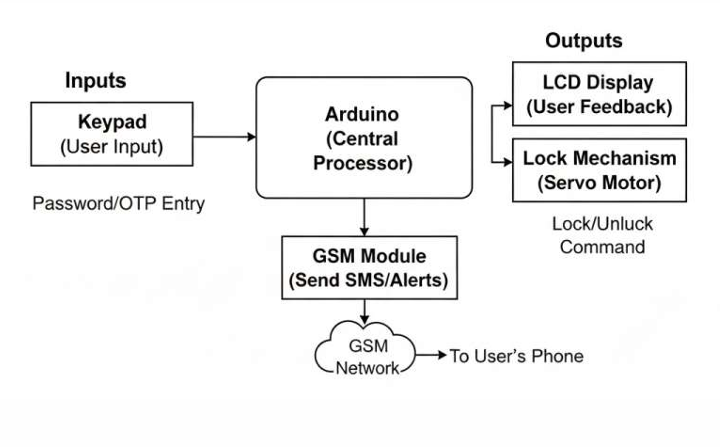
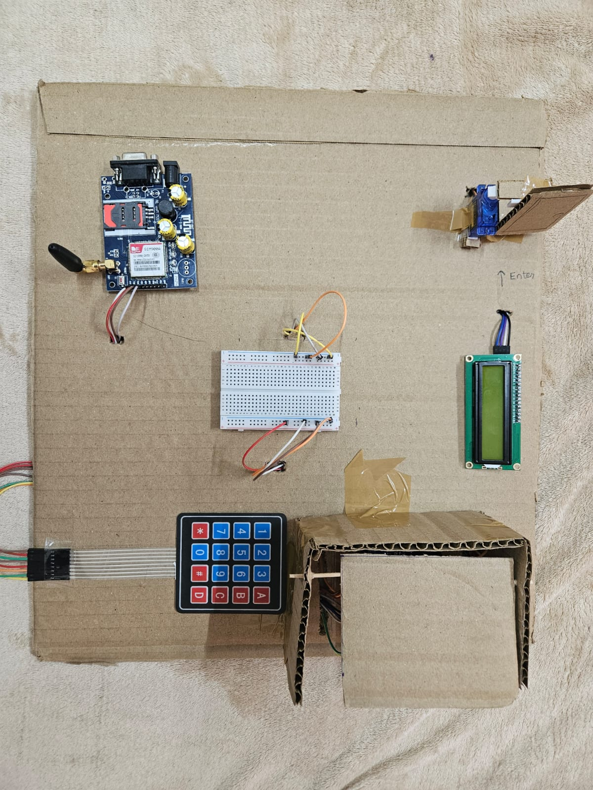

# GSM-Based OTP Smart Access Control System

An Arduino-based embedded security system that uses GSM communication and One-Time Password (OTP) authentication for secure access control.

---

## 📌 Project Overview

This project was developed to create a reliable and internet-independent smart locking system using GSM-based OTP verification. Unlike Wi-Fi dependent smart locks, the system operates using cellular communication, improving reliability and accessibility.

The system generates and verifies OTPs in real time, allowing secure access through keypad-based authentication while providing SMS alerts using GSM communication.

---

## 🚀 Features

* OTP-based authentication system
* GSM SMS communication
* Real-time password verification
* Servo motor lock/unlock mechanism
* LCD-based user interface
* Keypad password input
* SMS alerts for incorrect attempts

---

## 🛠 Hardware Components Used

* Arduino UNO
* GSM Module (SIM900A / SIM800L)
* 16x2 I2C LCD Display
* 4x4 Matrix Keypad
* SG90 Servo Motor
* Breadboard & Jumper Wires

---

## 💻 Technologies Used

* Embedded C
* Arduino IDE
* GSM AT Commands
* Serial Communication
* EEPROM Memory Handling

---

## ⚙️ Working Principle

1. System generates a random OTP.
2. OTP is sent to the authorized phone number through GSM.
3. User enters OTP using keypad.
4. If OTP is verified successfully, servo motor unlocks the door.
5. Incorrect attempts trigger SMS alert messages.

---

## 🧠 System Block Diagram

---

## 🔧 Hardware Prototype

---

## 📂 Repository Contents

* `gsm_otp_access_control.ino` → Arduino source code
* `Project_Report_GSM_OTP_Smart_Access_Control_System.pdf` → Project documentation
* `hardware_setup.jpeg` → Hardware prototype image
* `system block diagram.png` → Functional block diagram

---

## 🎯 Applications

* Smart home security
* Office access systems
* Hostel/Institutional security
* Restricted area access control

---

## ✅ Project Status

Completed hardware prototype with successful real-time OTP verification and access control implementation.

---

## 👨‍💻 Team Members

* Milind Sharma
* Akshaj Sharma
* Rahul Pakki
* Lakshya Lalan
